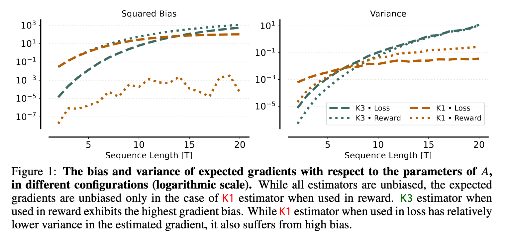

# Transparent GRPO

## [English Version](./README.md) | [Chinese Version](./README-cn.md)

**A minimal, single-file implementation of Group Relative Policy Optimization (GRPO).**

Current RLHF/RL libraries (TRL, OpenRLHF) are powerful but often hide the mathematical logic behind layers of abstraction, callbacks, and complex class inheritances. **Transparent GRPO** is designed for researchers and engineers who want to:

1. **Read everything in one flow:** No jumping between 10 files to find where the `loss` is actually calculated.
2. **Debug mathematically:** See exactly how the Advantages are normalized and how the KL penalty is applied.
3. **Prototype quickly:** Modify the core algorithm (e.g., change the KL estimator) by changing just one line of code.

### ✨ Key Features

* **< 400 Lines of Code:** The entire logic (Environment, Dataset, Model, Training Loop) fits in a single file.
* **Linear Logic Flow:** The code reads from top to bottom. `Generate` -> `Reward` -> `Advantage` -> `Update`.
* **State-of-the-Art Implementation:** Implements the *K1 Estimator in Rewards* (unbiased KL approximation) rather than the older K3-in-Loss approach. This aligns with recent findings ([*Shah et al., 2026*](https://arxiv.org/abs/2512.21852)) for lower variance and better stability in reasoning tasks.
* **Zero Bloat:** Depends only on `torch`, `transformers`, `accelerate`, and `numpy`. No heavy RL frameworks required.
* **Just Run It:** The single file code includes a toy math environment (Piecewise Function Continuity), which ensures it trains quickly on a single GPU, allowing you to verify correctness in minutes.

## Understand this repo

- `transparent_grpo.py`: The main script containing the entire GRPO implementation. Read from top to bottom to understand the flow.
- `logs/train_grpo_20260209_172905.log`: my example training log showing the reward and loss progression. 

No other things to worry about. No hidden files, no complex directory structure. Just one file to read and understand.

## 🚀 Quick Start

### 0. Hardware Requirements

Estimated VRAM usage for `Qwen2.5-3B-Instruct` (used in the code) with `group_size=4`, `max_new_tokens=512`, and `DeepSpeed ZeRO-2`:

| GPU Setup | Estimated VRAM per GPU | Status | Note |
| :--- | :--- | :--- | :--- |
| **1x A100 (80GB)** | ~35 GB | ✅ Easy | Perfect for single-GPU debugging. |
| **2x RTX 3090/4090 (24GB)** | ~22 GB | ⚠️ Tight | Requires ZeRO-2 to shard optimizer states. |
| **4x L4 (24GB)** | ~16 GB | ✅ Safe | Optimizer states are well-distributed. |
| **1x RTX 4090 (24GB)** | **OOM** | ❌ Fail | OOM unless you enable ZeRO-Offload (CPU). |

### 1. Installation

You only need standard PyTorch ecosystem libraries:

```bash
pip install torch transformers accelerate deepspeed numpy
```

### 2. Run Training

The script is configured to work out-of-the-box with Hugging Face Accelerate and DeepSpeed (ZeRO-2 recommended for the 3B model).

```bash
# Configure accelerate first if you haven't (select DeepSpeed/Zero2)
accelerate config

# Run the training script
nohup stdbuf -oL accelerate launch --use_deepspeed --zero_stage 2 transparent_grpo.py > logs/train_grpo_$(date +%Y%m%d_%H%M%S).log 2>&1 &
```

## 🧠 Understanding the Implementation

This repository strips away the magic. Here is where the core GRPO mechanics live in `transparent_grpo.py`:

| Component | Description |
| --- | --- |
| **Generation** | Standard `model.generate()` is called inside the loop. No hidden `Actor` classes. |
| **Group Sampling** | `Config.group_size = 4`. We generate $G$ outputs for every prompt. |
| **Reward Function** | A custom regular-expression based reward system for a specific algebra problem (`ToyEnv` in code). |
| **Ref Model LogProbs** | Calculate $\pi_{\text{ref}}(y \| x)$ |
| **KL Divergence** | Calculate the per-token KL: $\log \pi_\theta(y \| x) - \log \pi_{\text{ref}}(y \| x)$ |
| **The Advantage** | Calculated simply as `(rewards - mean) / std`. |
| **Loss Function** | Standard PPO clipping: $\min(r_t A_t, \text{clip}(r_t, 1-\epsilon, 1+\epsilon) A_t)$. |

Compared with [DeepSeekMath](https://arxiv.org/abs/2402.03300) (Original GRPO paper), this implementation:

1. Uses a toy environment instead of a large math dataset to ensure simplicity.
2. Implements the K1 estimator (KL in rewards) instead of K3 (KL in loss) for better stability & performance (see [*Shah et al., 2026*](https://arxiv.org/abs/2512.21852))
3. Retains the signature Group Relative Advantage normalization and PPO-style Clipping, ensuring the algorithm behaves exactly as GRPO should.

### The "K1 in Reward" Logic

Unlike older PPO implementations that put KL divergence in the loss function, this implementation follows [*Shah et al., 2026*](https://arxiv.org/abs/2512.21852) that subtracts the KL penalty directly from the rewards:

```python
# Code snippet from transparent_grpo.py
per_token_kl = token_log_probs.detach() - ref_token_log_probs.detach()
kl_penalty = (per_token_kl * loss_mask).sum(dim=1)
rewards_with_kl = rewards - Config.beta * kl_penalty
```

This approach (Unbiased K1 Estimator) provides better var & bias balanced gradients (more stable training) and better performance.



<small>*Image from [*Shah et al., 2026*](https://arxiv.org/abs/2512.21852) showing the variance reduction benefits of K1 in Rewards vs K3 in Loss.*</small>

### Toy Environment `ToyEnv`

To ensure the script runs quickly on modest hardware, it solves one specific **Piecewise Function Continuity** problem.

* **Goal:** Find $a+b$ such that the function is continuous.
* **Ground Truth:** $a=-3, b=3 \implies a+b=0$.
* **Reward:** Partial credits are given for identifying continuity points ($x=2, x=-2$), setting up correct equations, and solving for variables. This is needed for small scale testing.

*Note: This acts as a unit test for the algorithm. If the loss drops and reward goes to 1.0, the GRPO implementation is correct.*

## Limitations & Roadmap

This implementation prioritizes readability and educational value over production efficiency.

* **Generation Speed:** Uses standard HF `generate()`. For high-throughput training, integrate `vLLM` or `SGLang`.
* **Memory Efficiency:** Uses standard padding. Production runs should use Sequence Packing (Flash Attention varlen) to avoid computing on pad tokens.
* **Scalability:** Perfect for learning and debugging on 1-8 GPUs. For training 70B+ models on clusters, consider using this script as a logic reference to patch libraries like OpenRLHF or Verl.

## 📚 References

- [DeepSeekMath: Pushing the Limits of Mathematical Reasoning in Open Language Models](https://arxiv.org/abs/2402.03300)
- [A Comedy of Estimators: On KL Regularization in RL Training of LLMs](http://arxiv.org/abs/2512.21852)
- [JustRL: Scaling a 1.5B LLM with a Simple RL Recipe](https://arxiv.org/abs/2512.16649)


